# SELMA
Trial-ready **S**mall Vess**el** MRI **Ma**rkers -- version 1.4.7

The SELMA application is used for extracting and analysing flow information in cerebral vessels. 

**Table of Contents**

- Installation
- Running the program
    - Loading images
    - Viewing images
    - Applying masks
- Explanation of the algorithm
- Batch analysis
- Settings

# Installation

The program can be installed by cloning this repository. The easiest way of getting (and maintaining) the code is via:
https://desktop.github.com/
A short tutorial on how the software works is available at:
https://help.github.com/en/desktop/getting-started-with-github-desktop

The program can then compiled with any python distribution. The recommended method is to use Anaconda:
https://www.anaconda.com/
Ensure that your python distribution has the same number of bits as your matlab distribution.

In order to run the program, certain packages are needed. These need to be installed in the correct environment.
The easiest way to do this is to create a new Anaconda environment from the selmaEnvironment.yml file.

To do this, launch the 'Anaconda Prompt (Anaconda3)' program, navigate to the directory where the selmaEnvironment.yml file is located, and type the following command:
`conda env create -f selmaEnvironment.yml -n selmaEnvironment`

The environment can then be activated with:
`conda activate selmaEnvironment`

**Installing Matlab dependency**
The program uses some Matlab scripts. In order to run these, python needs to have access to the Matlab engine.
The following instructions are for installations using Anaconda, if you want to run the code in a different way, refer to [this](https://nl.mathworks.com/help/matlab/matlab_external/install-the-matlab-engine-for-python.html) link.

1. Start Anaconda Prompt as an administrator
2. Navigate to `matlabroot/extern/engines/python`, this is probably in: `C:\Program Files\MATLAB\R2020a\extern\engines\python`
3. Make sure the correct environment is activated
4. Run: `python setup.py install`
5. Test if it's working by starting spyder and running: `import matlab.engine`

Once the environment is active, the program can be launched by with either:
*  Typing `python selma.py`
*  Launching Spyder with `spyder` and running it from there.

In the future, SELMA will support installation via Docker.

# Running the program

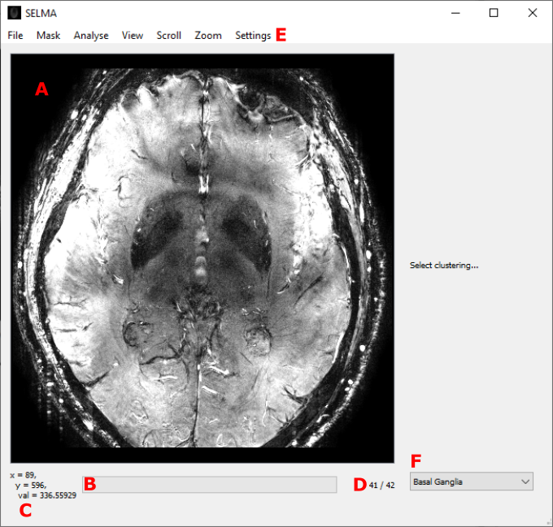

An overview of the layout of the program. Notable features are:
- A) the image space
- B) the status bar
- C) the cursor hover value 
- D) the frame number
- E) the menu bar

**Loading Dicoms**

A dicom can be loaded via the ‘file’-menu in the menubar, or by pressing Ctrl+O. The Dicom must contain magnitude and velocity or phase frames in order for the analysis to be performed. These can be in any order, but it is assumed that this order is the same for all types, such that each n-th velocity frame can be matched to the n-th magnitude frame.
The program currently supports both enhanced and classic dicoms (Ctrl+Shift+O) acquired on Philips, GE, and SIEMENS machines. Due to inconsistent usage of the DICOM header tags, not all data will immediately work. For more information, consult the developer's guide, section 'DICOM tags'.

Anatomical images can also be loaded via the file menu, or by pressing Ctrl+Alt+O. After selecting the file, the program will interpolate the image in the location of the PCA DICOM. This interpolation will be shown. Switching between viewing the anatomical image and the PCA DICOM can be done by pressing Tab.

**Viewing the Dicom**

After opening a Dicom file, the first of its frames is displayed. The frames can be cycled through by scrolling the mousewheel. The mousewheel can also be used to zoom in and out on the image on the screen if the Control key is pressed. The zoom-action will be centered around the cursor.
Moving and rescaling the image is also possible with the Scroll- and Zoom-menus in the menubar. 
Lastly, the brightness and contrast of the image can be changed by moving the mouse while pressing the middle mouse button. Moving the mouse in the vertical direction changes the brightness, while the horizontal direction changes the contrast. 

**Applying Masks**

The application only reports the analysis of vessels that are contained in a mask. When no mask is supplied, the program will not give any output. Masks can be applied in three different ways:
*  Segmenting -  A mask can be segmented from a T1 dicom by selecting the Segment Mask option from the mask menu in the menubar. A Cat-12 white matter segmentation algorithm is called. This feature is currently only supported for Sagittal T1 volumes. It might take up to 10 minutes to perform the segmentation. 
*  Loading from files - A pregenerated mask can be applied to the image by selecting the ‘Load Mask’ option from the mask menu in the menubar. The program currently supports .png, .npy, and .mat files. Note: not all .mat files work. If the program shows an error message, it might not be the right type of .mat file. Loading the mask in a newer version of Matlab (2019a+) and saving as .mat, might yield the correct filetype.
*  Drawing - A mask can be drawn on top of the currently displayed frame. This is done by pressing the left mouse button and moving the mouse. An exclusion zone can also be drawn when the right mouse button is pressed instead. Drawing in this way can add/subtract on any existing mask.

After a mask is obtained, it can be easily removed by drawing a large exclusion zone around it, or via the Clear Mask function in the mask menu. It can also be saved via the Save Mask function. 

# Explanation of Algorithm

Before starting the analysis, select the correct anatomical structure in the 'Structure' tab in the settings. This makes sure that the correct cluster settings are used in vessel detection. Without structure selection, the analysis will fail. For advanced users, there is an option to enable custom clustering. This will override the pre-applied cluster settings of the selected anatomical structure. By navigating to the Advanced Clustering tab in the settings, the user can freely select which magnitudes and flows to include in the analysis. The next step is the analysis. This can be run via the Analyse Vessels function in the Analyse menu. It can take a few minutes to perform the analysis. The current version of the program (1.4.6) doesn't have multithreaded support, so it might appear as if the program is frozen. Even if the operating system warns that the program might be stuck, please allow a few (up to 5) minutes to pass before shutting it down.

The details of the algorithm are more thoroughly described in this work: https://doi.org/10.1002/mrm.26821. Here, a short description of the steps is given.

The steps are:

0. **Subtract background**
The background of the velocity-frames is obtained by applying a median filter with a very large diameter. It is then subtracted from the velocity-frames in order to center the flow data of the vessels around zero. This median filter takes a long time and is the biggest contributor to the operating time of the algorithm.
1. **Determine SNR**
First the velocity frames are converted to phase frames. Next, the phase and magnitude frames are converted to a complex signal from which the standard deviation in the real and imaginary component are calculated. Next, the root mean square of these standard deviations is obtained and a median-filter is applied. Next, the SNR in the magnitude frames is found. Lastly, the SNR in the velocity frames is calculated.
2. **Find all voxels with significant flow**
Using this SNR, all voxels are compared against a sigma that can be set by the user (see Settings). Any voxels whose absolute SNR is larger, is counted as having significant flow.
3. **Remove zero-crossing voxels**
From these initial significant voxels, all those whose flow does not change direction along the time-axis (i.e. crosses zero), are kept.
4. **Remove Ghosting artifacts**
When switched on in the settings, this step finds the largest 'bright' (with high flow) vessels and creates a 'ghosting-zone' around them. Any significant voxels that fall within these zones, are discarded. The various parameters of the method can be changed in the settings window.
5. **Remove outer edge**
When switched on, a large exclusion zone in the form of a band of a user-defined width is formed around the edge of the image. Any significant voxel that falls within this zone is discarded. Note: this should be changed to a band around the edge of the brain, not the edge of the image.
6. **Apply mask**
All significant voxels that fall outside of the user-defined mask are discarded.
7. **Find all voxels with significant magnitude**
In much the same way as step 2, all voxels are tested for significance based on their magnitude. 
8. **Cluster voxels based on significant flow & magnitude**
All significant-flow voxels are first divided based on their magnitude values (significant positive / negative or not). For each of the possible six categories (possible or negative flow, positive, negative, or isointense magnitude) the voxels are clustered. 
9. **Remove non-perpendicular vessels**
When switched on in the settings, all voxel-clusters (assumed to be vessels) are either kept or discarded based on the shape of the cluster. Depending on some user-defined parameters, the vessels are judged on whether they are perpendicular to the imaging direction. If not, they are discarded.
10. **Deduplicate vessels**
When switched on in the settings, vessels that are closer than 6 pixels apart from each other are discarded.
11. **Report data of selected voxels**
For each of the vessels that has not been ruled out in previous steps, the velocity, magnitude etc. of each frame is collected and saved to a .txt file. 

# Batch Analysis

Batch analysis on both classic and enhanced dicom files is supported. Batch analysis can be found in the analysis menu in SELMA. Regular vessel analysis can be looped over all available dicom files in a single folder to decrease the amount of manual input in SELMA. The results of the vessel analysis of all dicom files in the folder are saved in a single .mat file for further analysis in MATLAB. The data are saved in a cell array where every cell corresponds with a single dicom file. The cells are filled with a structure containing all analysis results of the corresponding dicom file. The .mat file is stored in the same root folder that contains all dicom files. Because there is no multithreading support yet, the progress indicator is not functional and the GUI might appear frozen during batch analysis. A warning is issued to the user prior to batch analysis to not close the GUI while it is frozen as batch analysis will still be running in the background. Batch analysis will continue until it has been completed or an error has occured. In both circumstances the GUI should notify the user what is going on. 

**Enhanced dicom**

In order for batch analysis to properly function on enhanced dicom data, the following conditions have to be met:
1. All dicom files must be stored in a single root folder. Currently there is no support for enhanced dicom files stored in subfolders.
2. All masks segmenting anatomical structures must be drawn beforehand and saved in the same root folder.
3. All masks must contain the same file name of the corresponding dicom file. Furthermore, the mask file must also contain the following string in the name: '-mask'. 
4. All masks must be saved in a .mat format older than version 7.3.

The easiest way to meet all the requirements is to save all dicom files in a new root folder and then use SELMA to draw and save the masks for each dicom file in the root folder. Any mask drawn in SELMA automatically meets requirements 2, 3, and 4, and therefore should be applicable for batch analysis. Older masks need to be renamed according to requirement 3 if necessary and/or should be converted to an older .mat version in MATLAB. An easy way to do so in MATLAB is by using the following command: save(old_mask_name,'new_mask_name','-v7'). An example of the correct folder structure can be found below:

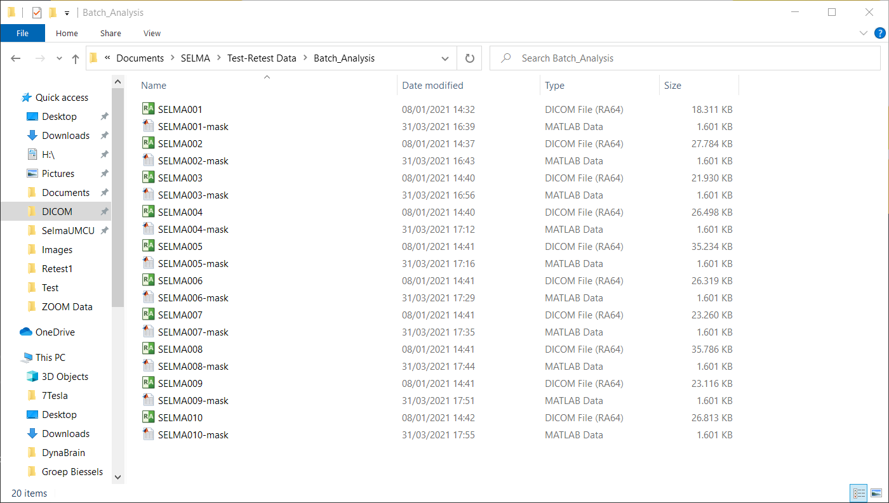

**Classic dicom**

In order for batch analysis to properly function on classic dicom data, the following conditions have to be met:
1. All classic dicom files belonging to a single subject must be stored in a single subject folder. All subject folders must be stored in a single root folder. It is recommended to name the specific subject folders according to the subject names. 
2. All masks segmenting anatomical structures must be drawn beforehand and saved in the subject folders together with the classic dicom files.
3. All masks must be saved in a .mat format older than version 7.3 and must also contain the following string in the name: '-mask'. It does not matter which classic dicom file the mask file takes the name from, as long as it contains the '-mask' string in the name. 

The easiest way to meet all the requirements is to save all dicom files belonging to a single subject in a specific subject folder, then save all subject folders into a single root folder. Subsequently, use SELMA to draw and save the masks for each subject by loading all classic dicom files of a single subject and then draw the mask. Any mask drawn in SELMA automatically meets requirements 2 and 3, and therefore should be applicable for batch analysis. The mask will copy the name of the first classic dicom file in the subject folder, but should be applicable for all classic dicom files in the folder. Older masks need to be renamed according to requirement 3 if necessary and/or should be converted to an older .mat version in MATLAB. An easy way to do so in MATLAB is by using the following command: save(old_mask_name,'new_mask_name','-v7'). An example of the folder structure can be found below:

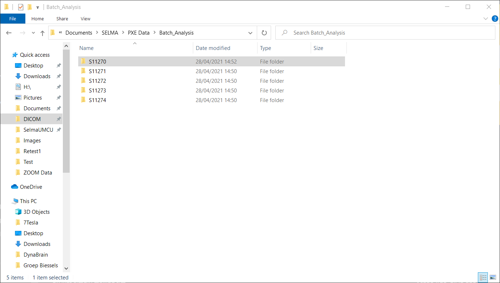
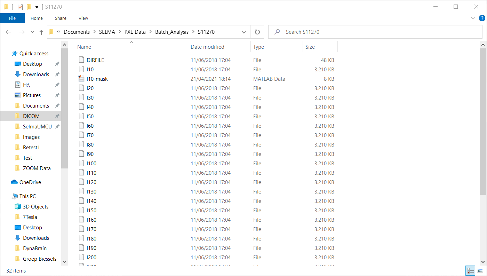

# Settings

The Settings window can be accessed via the settings menu. It has multiple tabs related to multiple parts of the program. An overview of the different settings is given below. Most settings also explain their use in more detail when hovering over the text in the window.

**General**

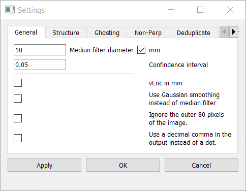

The following settings exist in the general tab:
1. **Median filter diameter** 
This is the size of the kernel with which the median filter is applied in the algorithm. A togglebox next to the setting gives the user the option to specify the diameter in mm or in pixels.
2. **Confidence interval**
This sets the confidence interval for determining significance of a vessel. An interval of 0.05 corresponds to p < 0.05 significance.
3. **vEnc in mm**
Some images specify the velocity encoding (vEnc) in mm/s instead of the usual cm/s. When this box is toggled, the vEnc is divided by 10 in order to get the correct cm/s units which the algorithm assumes.
4. **Use Gaussian smoothing instead of median filter**
The median filter operation can take several minutes when working with a large image & large diameter. Under circumstances where speed is more important than accuracy, this can be toggled on to perform a Gaussian smoothing operation instead of a median filter. It produces similar results, but is much faster. **N.B. don't use this for any important analysis!**
5. **Ignore outer band**
When toggled on, step 5 in the algorithm (see above) is used.
6. **Use a decimal comma in the output instead of a dot**
When a decimal comma is preferred in the output for further analysis, it can be turned on with this setting

**Structure**

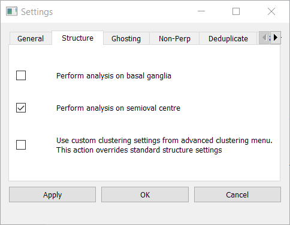

1. **Perform analysis on basal ganglia**
When toggled on, the vessel analysis will use the standard clustering settings defined for the basal ganglia (Positive magnitude and velocity).
2. **Perform analysis on semioval centre**
When toggled on, the vessel analysis will use the standard clustering settings defined for the semioval centre (Any magnitude and negative velocity).
3. **Use custom clustering settings from advanced clustering menu.**
When toggled on, custom clustering settings from the advanced clustering menu is enabled. Settings from the advanced clustering menu override the standard clustering settings of the anatomical structures. 

**Ghosting**

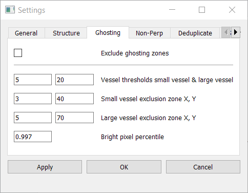

1. **Exclude ghosting zones**
When turned on, step 4 in the algorithm (see above) is used.
2. **Vessel thresholds small vessel & large vessel**
Thresholds for determining small & large vessel clusters.
3. **Small vessel exclusion zone X,Y**
Size of exclusion zone around a small vessel. See image below.
4. **Large vessel exclusion zone X,Y**
Size of exclusion zone around a large vessel. See image below.
5. **Bright pixel percentile**
Percentile threshold for classification as a bright pixel.

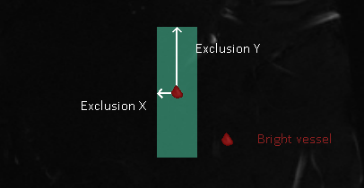

**Non-Perpendicular**

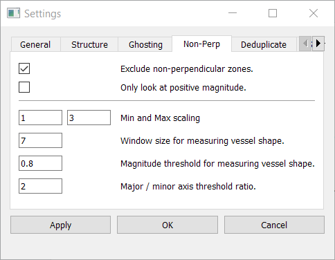

1. **Exclude non-perpendicular zones**
When turned on, step 9 in the algorithm (see above) is used.
2. **Only look at positive magnitude**
When toggled on, only clusters with positive magnitude are assessed for perpendicularity
3. **Min and max scaling**
Limits for determining magnitude scaling factor
4. **Window size for measuring vessel shape**
Window around cluster for determining perpendicularity.
5. **Magnitude threshold for measuring vessel shape**
Magnitude threshold for clustering vessels on magnitude frame to determine perpendicularity.
6. **Major / minor axis threshold ratio**
When the major / minor axis threshold ratio is bigger than X:1 (where X is the value of the box), the vessel will be classified as being non-perpendicular.

**Deduplication**

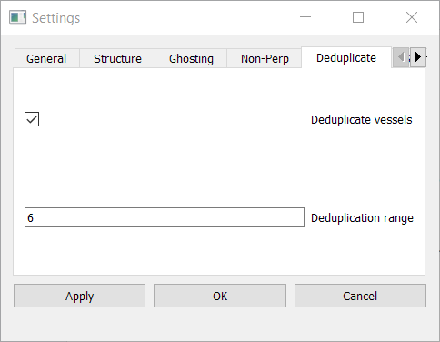

1. **Deduplicate vessels**
When turned on, step 10 of the algorithm (see above) is used.
2. **Deduplication range**
Minimum pixel distance between two vessels for not to be removed as two duplicate vessels

**Segmentation**

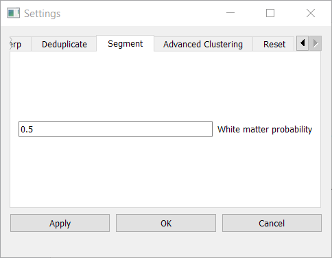

1. **White matter probability**
Sets the threshold for segmenting the white matter with Cat-12. 

**Advanced Clustering**

1. **Include clusters with significant positive magnitude**
When toggled on, clusters with a significant positive magnitude are included in the vessel analysis. 
2. **Include clusters with significant negative magnitude**
When toggled on, clusters with a significant negative magnitude are included in the vessel analysis. 
3. **Include clusters with significant isointense magnitude**
When toggled on, clusters with a significant isointense magnitude are included in the vessel analysis. 
4. **Include clusters with significant positive velocity**
When toggled on, clusters with a significant positive velocity are included in the vessel analysis. 
5. **Include clusters with significant negative velocity**
When toggled on, clusters with a significant negative velocity are included in the vessel analysis. 

**Reset**

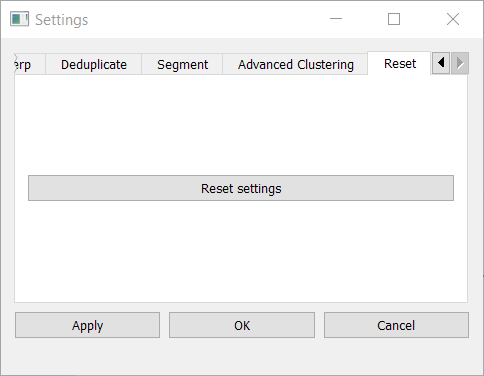

1. **Reset settings**
Reset the settings to the default values

